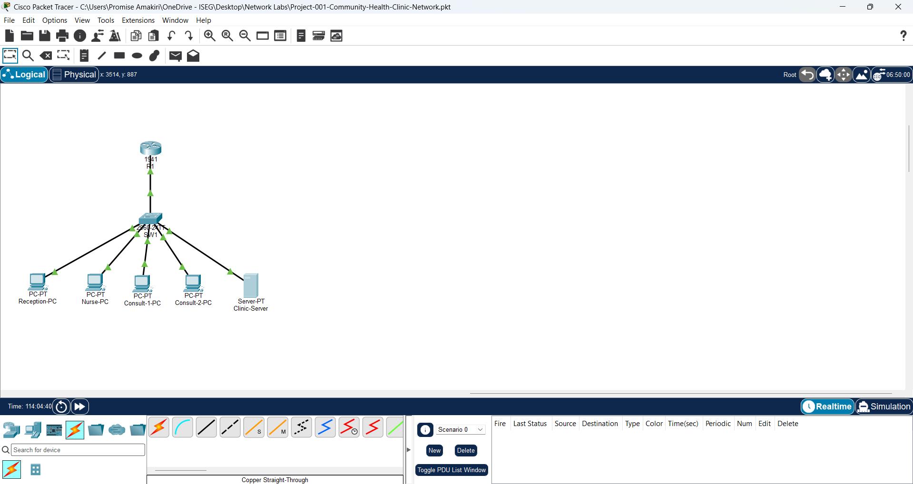

# Project 001 - Community Health Clinic Network


## Project Overview

This project documents the design and implementation of a basic network for a community health clinic using Cisco Packet Tracer.

The network connects clinical and administrative workstations to a central switch, router, and clinic server.


## Project Objectives

- Design a basic clinic network using Cisco Packet Tracer.
- Connect workstations and a server through a central switch.
- Configure a router interface with an IP address.
- Configure IPv4 addresses on network devices.
- Test connectivity using ICMP ping.
- Document the network design and configuration.


## Network Topology

The clinic network consists of one Cisco router, one Cisco switch, four workstations, and one server.

The router provides the network gateway, while the switch provides connectivity between devices on the local network.




## IP Addressing

| Device | Interface | IP Address | Subnet Mask | Default Gateway |
|---|---|---|---|---|
| R1 | G0/0 | 192.168.10.1 | 255.255.255.0 | N/A |
| Reception-PC | FastEthernet0 | 192.168.10.10 | 255.255.255.0 | 192.168.10.1 |
| Nurse-PC | FastEthernet0 | 192.168.10.11 | 255.255.255.0 | 192.168.10.1 |
| Consult-1-PC | FastEthernet0 | 192.168.10.12 | 255.255.255.0 | 192.168.10.1 |
| Consult-2-PC | FastEthernet0 | 192.168.10.13 | 255.255.255.0 | 192.168.10.1 |
| Clinic-Server | FastEthernet0 | 192.168.10.100 | 255.255.255.0 | 192.168.10.1 |

## Connectivity Testing

Connectivity was verified using ICMP ping tests.

| Source | Destination | Result |
|---|---|---|
| Nurse-PC | Reception-PC (192.168.10.10) | Successful - 0% packet loss |
| Nurse-PC | R1 (192.168.10.1) | Successful - 0% packet loss |
| Consult-1-PC | Reception-PC (192.168.10.10) | Successful - 0% packet loss |
| Consult-2-PC | Consult-1-PC (192.168.10.12) | Successful - 0% packet loss |
| Clinic-Server | Reception-PC (192.168.10.10) | Successful - 0% packet loss |
| Nurse-PC | 192.168.10.99 | Failed - Request timed out |

## Router Configuration

The router was configured using the Cisco IOS command-line interface (CLI).

```text
enable
configure terminal
interface gigabitEthernet 0/0
ip address 192.168.10.1 255.255.255.0
no shutdown
```

The `no shutdown` command was used to activate the GigabitEthernet0/0 interface.

## Troubleshooting

### Issue: Router-to-Switch Link Initially Down

The link between R1 and SW1 initially appeared red in Cisco Packet Tracer.

The GigabitEthernet0/0 interface on R1 was administratively down.

#### Resolution

The interface was entered through the Cisco IOS CLI and activated using:

```text
interface gigabitEthernet 0/0
no shutdown
```

The link subsequently changed to green, confirming that the interface was operational.

## Lessons Learned

This project provided practical experience with:

- Basic network topology design.
- Cisco Packet Tracer.
- Cisco IOS CLI navigation.
- IPv4 addressing and subnet masks.
- Default gateways.
- Ethernet switching.
- ICMP connectivity testing.
- Basic network troubleshooting.
- Technical documentation using Markdown.
